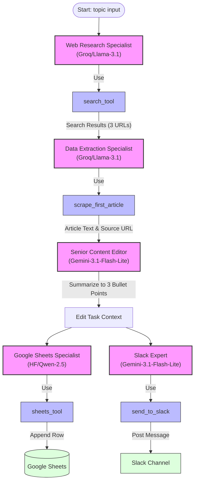

# News Notifier CrewAI

**News Notifier CrewAI** is a production-ready, multi-agent AI pipeline built on top of [CrewAI](https://github.com/crewAIInc/crewAI). It automates the workflow of monitoring topics, researching news, scraping articles, summarizing key information, and distributing the results directly to Google Sheets and Slack channels.

The project features cross-LLM routing, utilizing specialized models (Groq Llama 3.1, Google Gemini 3.1, and Hugging Face Qwen 2.5) for different stages of the research and distribution pipeline to optimize performance, accuracy, and cost.

---

## 🚀 Key Features

* **Multi-Agent Orchestration**: Powered by CrewAI, utilizing 5 autonomous agents working sequentially.
* **Smart Web Research**: Searches Google News via Serper API and scrapes article text using Jina Reader.
* **Cross-LLM Routing**:
  * **Groq (Llama-3.1-8b)** for fast web research and scraping logic.
  * **Gemini (Gemini-3.1-Flash-Lite)** for high-quality summarizing and Slack delivery logic.
  * **Hugging Face (Qwen-2.5-7B)** for Google Sheets distribution.
* **Dual Automation Support**:
  * **GitHub Actions**: Run on a daily cron job schedule with zero infrastructure overhead.
  * **Vercel Serverless / Cron**: Deployable as a serverless endpoint on Vercel with a native vercel cron configuration.
* **Google Sheets Integration**: Automatically appends date, summary, and article URL into Google Sheets using Google Service Account credentials.
* **Slack Notifications**: Sends structured summary bullet points and links directly to a Slack channel via Incoming Webhooks.

---

## 🛠️ Architecture

The following diagram illustrates how agents, tasks, and tools interact inside the pipeline:



---

## 📁 Repository Structure

```
├── .github/
│   └── workflows/
│       └── daily_research.yml   # GitHub Actions workflow for daily scheduler
├── api/
│   └── cron.py                  # Vercel serverless function entrypoint
├── tools/
│   ├── credentials.json         # Google Service Account keys (gitignored)
│   ├── scrape_tool.py           # Jina Reader web scraping tool
│   ├── search_tool.py           # Serper.dev Google News search tool
│   ├── sheets_tool.py           # Google Sheets connector (using gspread)
│   ├── slack_tool.py            # Slack incoming webhook connector
│   └── summarizer_tool.py       # Custom Groq LLM summary utility
├── crew.py                      # Main CrewAI pipeline definition & local entrypoint
├── pyproject.toml               # Project metadata & dependency list
├── requirements.txt             # Pinned package requirements
└── vercel.json                  # Vercel routing and cron job schedule
```

---

## 🔧 Prerequisites & Setup

### 1. Environment Variables

Create a `.env` file in the root directory (based on `.env` template) with the following credentials:

```bash
# LLM Providers API Keys
GROQ_API_KEY=your_groq_api_key_here
GEMINI_API_KEY=your_gemini_api_key_here
HUGGINGFACE_API_KEY=your_huggingface_api_key_here

# Tool API Keys
X_API_KEY=your_serper_api_key_here          # Serper.dev API key for Google News Search
SLACK_WEBHOOK_URL=your_slack_webhook_url    # Slack Incoming Webhook URL
```

### 2. Google Sheets Setup

To enable logging to Google Sheets, you need to configure a Google Cloud service account:

1. Go to the [Google Cloud Console](https://console.cloud.google.com/).
2. Create a project and enable the **Google Drive API** and **Google Sheets API**.
3. Create a **Service Account** and generate a new key in **JSON** format.
4. Download the JSON key file and place it in the `tools/` folder as `credentials.json`.
5. Open your spreadsheet in Google Sheets and copy its Spreadsheet ID from the URL:
   `https://docs.google.com/spreadsheets/d/<SPREADSHEET_ID>/edit`
6. Make sure the `SHEET_ID` variable in [sheets_tool.py](file:///d:/Internship/task%208%20crewai/tools/sheets_tool.py) matches your spreadsheet ID.
7. Share the Google Sheet with the Service Account email address (found inside `credentials.json` as `client_email`) giving it **Editor** permissions.

---

## 💻 Local Installation & Usage

1. **Clone the Repository** and navigate to the project directory:
   ```bash
   cd "task 8 crewai"
   ```

2. **Create and Activate a Virtual Environment**:
   ```bash
   python -m venv .venv
   # Windows:
   .venv\Scripts\activate
   # macOS/Linux:
   source .venv/bin/activate
   ```

3. **Install Dependencies**:
   ```bash
   pip install -r requirements.txt
   ```

4. **Run the CrewAI Agent Pipeline Locally**:
   ```bash
   python crew.py
   ```
   *By default, the script triggers a run seeking news on the topic `"Snakes"`. You can modify this in [crew.py](file:///d:/Internship/task%208%20crewai/crew.py#L184).*

---

## ☁️ Automation & Deployment

### Option A: GitHub Actions (Recommended for zero-cost cron)
The repository contains a workflow configured to run the pipeline daily.
To set it up:
1. Go to your GitHub repository -> **Settings** -> **Secrets and variables** -> **Actions**.
2. Add the following **Repository Secrets**:
   * `GEMINI_API_KEY`
   * `GROQ_API_KEY`
   * `HUGGINGFACE_API_KEY`
   * `X_API_KEY`
   * `SLACK_WEBHOOK_URL`
   * `GOOGLE_SHEETS_CREDENTIALS` (Paste the entire contents of your local `tools/credentials.json` file)
3. The workflow runs daily at 09:00 UTC and can also be triggered manually using the **Run workflow** button under the **Actions** tab.

### Option B: Vercel Deploy (Serverless function API endpoint)
The project is configured for serverless deployment on Vercel:
1. Import your repository into Vercel.
2. Configure the same environment variables in your Vercel Project Settings.
3. Configure the `GOOGLE_SHEETS_CREDENTIALS` env variable if necessary, or ensure `tools/credentials.json` is securely packaged (Note: keeping credentials in github/git is not recommended, so using the GitHub Action secrets flow is cleaner).
4. Vercel cron is defined in `vercel.json` to execute GET requests to `/api/cron` daily.

---

## 🛠️ LiteLLM Groq Workaround
LiteLLM integration inside CrewAI occasionally includes a `cache_breakpoint` key in message payloads, which Groq's API rejects. This repository implements a patch in [crew.py](file:///d:/Internship/task%208%20crewai/crew.py#L14-L26) to automatically intercept API calls and sanitize message dictionaries, ensuring smooth execution with Groq LLM providers.
